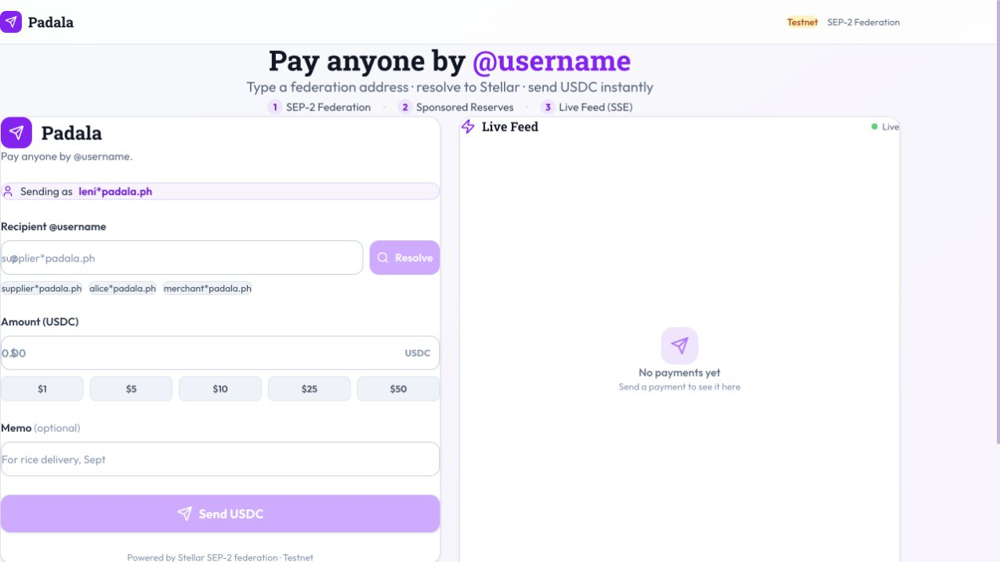
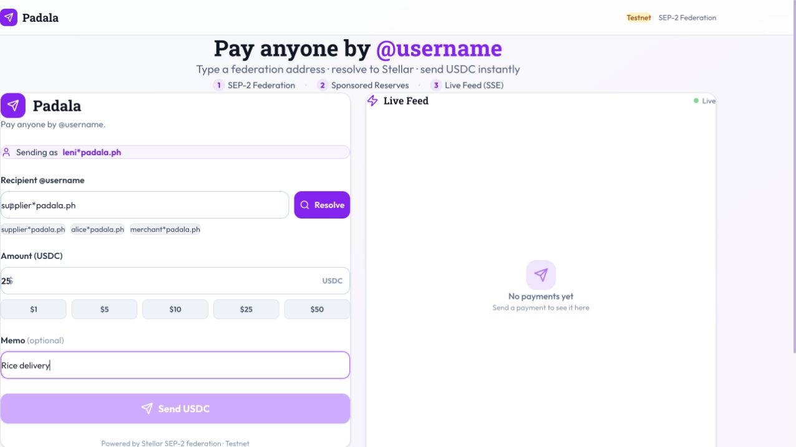

# Padala

## Pay anyone by `@username` with Stellar

Padala turns a human-friendly federation address such as `supplier*padala.ph` into a verified Stellar destination. The product is designed for remittances and everyday USDC payments where copying a long public key is the biggest source of mistakes.



> Current mode: testnet/demo. Wallet signing and mainnet evidence are intentionally kept as a later gate; this repository does not claim a live mainnet deployment yet.

## Why it exists

Stellar addresses are safe but difficult to share and verify. Padala gives the sender a familiar username flow while keeping the settlement destination, asset issuer, network, amount, memo, signature, and Horizon result explicit and verifiable.

## How it works

1. Enter a federation address such as `alice*padala.ph`.
2. Resolve it through the SEP-2-compatible federation service.
3. Review the destination and enter a USDC amount and optional memo.
4. In normal mode, the server builds an unsigned transaction and returns its digest.
5. An external wallet signs the envelope; the server verifies the signed transaction before submission.
6. The payment feed records confirmed results for the product UI.



## What makes it real

- SEP-2-style username resolution is backed by active federation records.
- Classic Stellar USDC uses seven-decimal stroops: `1 USDC = 10,000,000`.
- The configured Stellar network and USDC issuer are bound to server configuration.
- The server never receives or stores a wallet secret key.
- Normal payment flow is `prepare → external sign → confirm`, with exact intent matching.
- Horizon is the source of truth for account state and confirmed transaction results.
- Demo simulation is gated to non-public networks and is never presented as mainnet proof.

## Stellar integration

| Surface | Implementation |
|---|---|
| Username routing | Federation lookup for `username*domain` |
| Asset | Configured issued USDC asset, seven decimal places |
| Transaction | Classic Stellar payment with optional text memo |
| Signing | External wallet boundary; no private-key custody |
| Verification | Source, signature, operation, destination, amount, asset, and network checks |
| Observation | Horizon account lookup and payment confirmation |
| Live activity | Server-sent payment feed for confirmed records |

## Routes

| Path | Purpose |
|---|---|
| `/` | Landing page, payment form, and live feed |
| `GET /api/resolve?address=alice*padala.ph` | Resolve a federation address |
| `GET /api/federation` | List active federation records |
| `POST /api/payments/prepare` | Build an unsigned payment intent |
| `POST /api/payments/:id/confirm` | Verify and submit an externally signed envelope |
| `GET /api/payments` | List recent recorded payments |
| `GET /api/payments-feed` | Stream payment events over SSE |

## Repository map

```text
src/app/                 Next.js page and API routes
src/server/lib/          Stellar, amount, HTTP, and event helpers
src/server/service/      Federation and payment services
src/ui/components/       Payment form and live feed
drizzle/                 Database schema and payment-intent migration
docs/                    Readiness and on-chain evidence notes
screen-shot/             Product screenshots used in this README
tests/                   Unit, service, UI, and end-to-end coverage
```

## Local quick start

```bash
npm install
cp .env.example .env.local
# set a real PostgreSQL URL and a random SESSION_SECRET in .env.local
npm run db:push
npm run dev
```

Open `http://localhost:3003`.

Required environment values are documented in [`.env.example`](.env.example). Never commit `.env`, `.env.local`, seed phrases, private keys, or provider credentials.

## Verification

The current 016 working copy has been verified with:

```bash
npm test       # 33 tests passing
npm run build  # production build passing
```

## Mainnet readiness

This project is not claiming mainnet readiness yet. Before a live launch, complete the gates in [`docs/MAINNET_READINESS.md`](docs/MAINNET_READINESS.md) and record reproducible public evidence in [`docs/ONCHAIN_EVIDENCE.md`](docs/ONCHAIN_EVIDENCE.md).

Mainnet requires a real federation domain, production database, configured public USDC issuer, external wallet signer, recipient trustline checks, idempotent payment intents, Horizon reconciliation, and public transaction links.

## Hackathon scope

Track concept: payments and remittances on Stellar. The current slice focuses on username-based routing and safe classic Stellar payment preparation. Soroban contracts and wallet automation are deliberately not invented for this project; they can be added only if the product scope requires them.
